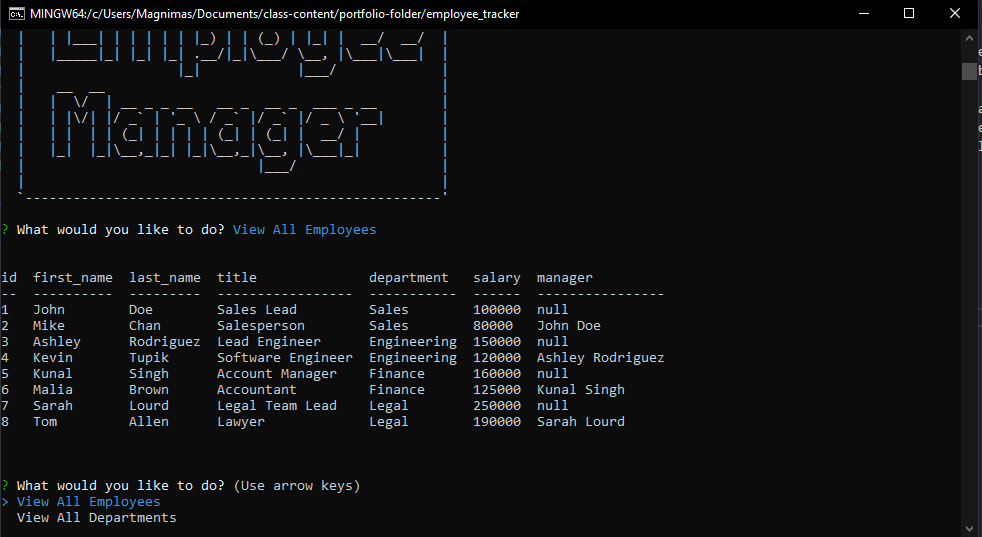
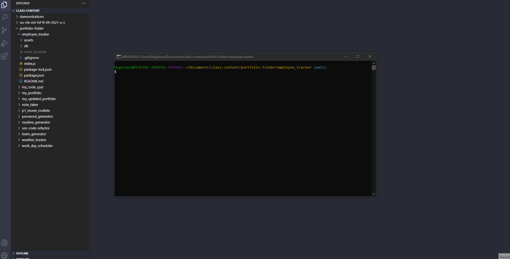

# Employee Tracker

Building an app utilizing sql in order to track employee information.

# Pseudo Code

* WANT to be able to view and manage the departments, roles, and employees in my company THAT I can organize and plan my business
* WHEN the application is started, THEN the following options: view all departments, view all roles, view all employees, add a department, add a role, add an employee, and update an employee role are presented
* WHEN all departments are viewed, THEN a formatted table showing department names and department ids are presented
* WHEN all roles are viewed, THEN the job title, role id, the department that role belongs to, and the salary for that role are presented
* WHEN all employees are viewed, THEN a formatted table showing employee data, including employee ids, first names, last names, job titles, departments, salaries, and managers that the employees report to are presented
* WHEN a department is added, THEN a prompt is given to enter the name of the department and that department is added to the database
* WHEN a role is added, THEN a prompt is given to enter the name, salary, and department for the role and that role is added to the database
* WHEN an employee is added, THEN a prompt is given to enter the employee’s first name, last name, role, and manager, and that employee is added to the database
* WHEN an employee role is updated, THEN a prompt is given to select an employee to update and their new role and this information is updated in the database

# Screenshot

# Demonstration

# Video

[Employee Tracker demonstration video link](https://drive.google.com/file/d/1--Oea0A8mTCCAknjfQmV0-MxPuaMA_m5/view?usp=sharing)